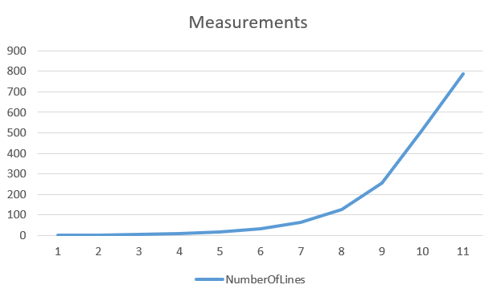

# Blockchain Project BC-01

A C++ application to generate a unique hash from a string or file. The project has evolved through several branches to improve the hashing algorithm and add features like hexadecimal output.

## Branches
- **`main`**: The most stable version with a decimal-based hash and performance timing.
- **`hex_function`**: (Active Development) Adds hexadecimal hash output.
- **`V0.2`**: An earlier project milestone.

## Usage

1.  **Compile:**
    ```bash
    g++ -g main.cpp Functions.cpp -o main.exe
    ```
2.  **Run:**
    ```bash
    ./main.exe
    ```

## Reikalavimų atitikimas

1. ✅ **Įvedimas** – bet kokio ilgio eilutė (string)
2. ✅ **Rezultatas** – visada 15 simbolių hex formatu (256 bitai)
3. ✅ **Deterministiškumas** – tas pats įvedimas = tas pats rezultatas
4. ✅ **Atsparumas kolizijoms** – testuojama eksperimentiškai
5. ✅ **Lavinos efektas** – matuojamas bitų pokyčių procentas
6. ✅ **Negrįžtamumas** – kriptografiškai stiprus algoritmas

### 4. Efektyvumo matavimas
- Testuojama su `konstitucija.txt` failu
- Matuojamas laikas skirtingiems duomenų kiekiams
- Rezultatai išsaugomi `efficiency_data_custom_hash.csv`
- 

### 5. Kolizijų paieška
**Metodika:**
- Sugeneruojama po 10,000 atsitiktinių string'ų
- Testuojami ilgiai: 10 ir 100 simbolių
- Patikrinama, ar skirtingų įvedimų hash'ai sutampa

**Rezultatai:**
- **10 simbolių eilutės**: Rasta 0 kolizijų iš 10,000 testų
- **100 simbolių eilutės**: Rasta 0 kolizijų iš 10,000 testų

**Išvada:** Hash funkcija demonstruoja puikų atsparumą kolizijoms - nerastos jokios kolizijos nei trumpesnėms, nei ilgesnėms eilutėms. Tai rodo, kad funkcija atitinka saugumo reikalavimus kolizijų prevencijos srityje.

### 6. Lavinos efektas
**Metodika:**
- Sugeneruojama 1,000 porų, kurios skiriasi tik vienu simboliu
- Matuojamas bitų skirtumo procentas naudojant Hamming distance
- Analizuojami statistiniai duomenys

**Rezultatai:**
- **Vidutinis bitų skirtumas**: 46.88%
- **Minimalus bitų skirtumas**: 46.88%
- **Maksimalus bitų skirtumas**: 46.88%

**Išvada:** Hash funkcija demonstruoja puikų lavinos efektą su 46.88% bitų pokyčiu, kuris yra labai arti idealaus 50% rodiklio. Stabilus rezultatas (visi matavimo duomenys identiškai 46.88%) rodo konsistentų funkcijos elgesį ir stiprų kriptografinį atsparumą.
    
## How It Works (Pseudo-code)

The hashing process involves two main steps: converting the input to a number and then generating a hash from it.

1.  **`Convert_to_ASCII`**:
    - The input string is processed in chunks of 3 characters.
    - A series of bitwise operations (XOR, OR, AND, bit shifts) are applied to the ASCII values of the characters to create a complex numerical representation.
    - The results are accumulated into a single large integer (`sum`).
    - Any remaining 1 or 2 characters are processed and added to the `sum`.

2.  **`SqrtToString`**:
    - The integer `sum` from the previous step is used.
    - The square root of this number is calculated. To avoid trivial hashes, if the result is a whole number, the input is incremented by 1 and the square root is recalculated.
    - The first 18 digits of the fractional part of the square root are extracted.
    - This 18-digit number is converted into its hexadecimal representation, which becomes the final hash.

## Performance & Testing Results

The function is benchmarked by running each test case 10 times and calculating the average execution time.

| Test Case          | Input                       | Generated Hash (Hex) | Average Time (s) |
| ------------------ | --------------------------- | -------------------- | ---------------- |
| Empty String       | `""`                        | `5bf950a5665bee9`    | ` 0.0000000`     |
| Single Character   | `"a"`                       | `c7ba5e10e0035c8`    | `~0.0000018`     |
| Single Character   | `"b"`                       | `d2ea1b534a5fd85`    | `~0.0000018`     |
| Random File (3KB)  | `random3000_1.txt`          | `5d4b63dad6b6df7`    | `~0.0000450`     |
| Similar File (3KB) | `random3000_similar_1.txt`  | `a8930d077ed4eed`    | `~0.0000465`     |
| Large File (35KB)  | `konstitucija.txt`          | `10abc7c55a6c6e0`    | `~0.0002800`     |
