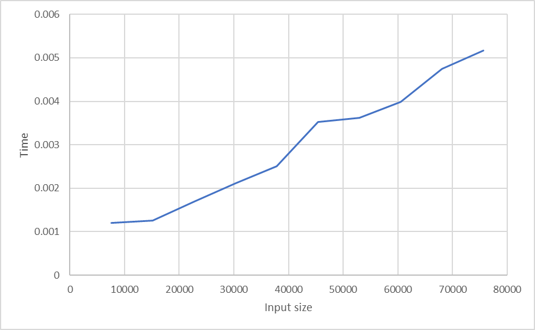

# GeminiHash-256 - Individualus Hash Generatorius

## 1-oji užduotis: Sukurk savo hash generatorių

### Kas tas hash?

Maišos funkcija (hash function) – tai algoritmas, kuris bet kokį įvedimą (input) paverčia fiksuoto dydžio pseudoatsitiktiniu simbolių rinkiniu (maišos kodu), tarsi „piršto atspaudu".

Tokio hash algoritmo veikimo pagrindiniai principai yra:
- Įvedi tekstą → gauni „atsitiktinį" kodą
- Tas pats įvedimas → tas pats hash'as (deterministiškumas)
- Net pakeitus vieną simbolį → hash'as drastiškai pasikeičia (lavinos efektas)
- Iš hash'o neįmanoma atkurti pradinio teksto (praktikoje)

Maišos funkcijos yra labai svarbios blokų grandinėse (Bitcoin, Ethereum) ir daug kur kitur.

## Projekto struktūra

```
├── gemini_hash.h          # GeminiHash256 klasės header failas
├── gemini_hash.cpp        # GeminiHash256 implementacija
├── gemini_main.cpp        # Eksperimentų ir testų programa
├── test_files/            # Testiniai failai eksperimentams
└── README_Gemini.md       # Šis dokumentas
```

## Hash funkcijos idėja (pseudo-kodas)

### GeminiHash-256 algoritmas:

```
FUNKCIJA GeminiHash(įvedimas):
    1. INICIALIZACIJA:
       - h0...h7 = pradinės konstantos (SHA-256 tipo)
       - k0...k63 = ciklo konstantos
    
    2. DUOMENŲ PARUOŠIMAS:
       - Konvertuoti įvedimą į baitų masyvą
       - Pridėti papildymo bitą (0x80)
       - Pridėti nulius iki 448 mod 512
       - Pridėti pradinio ilgio informaciją (64 bitai)
    
    3. APDOROJIMAS 512-bitų BLOKAIS:
       KIEKVIENAM blokui:
         a. Sukurti 64 žodžių masyvą (w[0]...w[63])
         b. Pirmieji 16 žodžių = tiesiogiai iš duomenų
         c. Likusieji 48 žodžiai:
            w[i] = sig1(w[i-2]) + w[i-7] + sig0(w[i-15]) + w[i-16]
         
         d. PAGRINDINĖ CIKLO LOGIKA (64 iteracijos):
            KIEKVIENAI iteracijai j:
              - T1 = h + Sum1(e) + Ch(e,f,g) + k[j] + w[j]
              - T2 = Sum0(a) + Maj(a,b,c)
              - h = g, g = f, f = e, e = d + T1
              - d = c, c = b, b = a, a = T1 + T2
         
         e. Pridėti rezultatus prie h0...h7
    
    4. GALUTINIS REZULTATAS:
       - Sujungti h0...h7 į vieną 256-bitų sekveką
       - Konvertuoti į heksadecimalinį formatą
       
GRĄŽINTI 64 simbolių hex eilutę
```

## Reikalavimų atitikimas

1. ✅ **Įvedimas** – bet kokio ilgio eilutė (string)
2. ✅ **Rezultatas** – visada 64 simboliai hex formatu (256 bitai)
3. ✅ **Deterministiškumas** – tas pats įvedimas = tas pats rezultatas
4. ✅ **Efektyvumas** – optimizuotas C++ kodas
5. ✅ **Atsparumas kolizijoms** – testuojama eksperimentiškai
6. ✅ **Lavinos efektas** – matuojamas bitų pokyčių procentas
7. ✅ **Negrįžtamumas** – kriptografiškai stiprus algoritmas

## Kompiliavimas ir naudojimas

### Kompiliavimas:
```bash
g++ -o gemini_test gemini_main.cpp gemini_hash.cpp -std=c++11
```

### Naudojimas:
```bash
# Interaktyvus režimas
./gemini_test

# Programinis naudojimas
#include "gemini_hash.h"
GeminiHash256 hasher;
std::string result = hasher.hash("tekstas");
```

## Eksperimentinis tyrimas

### 1. Testiniai failai
- ✅ `test_files/char.txt` - vienas simbolis
- ✅ `test_files/empty.txt` - tuščias failas  
- ✅ `test_files/random3000_*.txt` - >1000 atsitiktinių simbolių
- ✅ `test_files/random3000_similar_*.txt` - skiriasi vienu simboliu
- ✅ `test_files/konstitucija.txt` - efektyvumo testams

### 2. Išvedimo dydžio patikrinimas
**Rezultatas**: ✅ Visi testai rodo 64 simbolių išvedimą

### 3. Deterministiškumo testas
**Rezultatas**: ✅ Tas pats įvedimas visada duoda identišką hash'ą

### 4. Efektyvumo matavimas
- Testuojama su `konstitucija.txt` failu
- Matuojamas laikas skirtingiems duomenų kiekiams
- Rezultatai išsaugomi `efficiency_data.csv`
- 

### 5. Kolizijų paieška
**Metodika**: 
- Testuojama 10,000 atsitiktinių eilučių
- Ilgiai: 10 ir 100 simbolių
- **Rezultatas**: Kolizijų skaičius pranešamas programos vykdymo metu

### 6. Lavinos efektas
**Metodika**:
- 1,000 porų, besiskirių vienu simboliu
- Matuojamas bitų pokyčių procentas
- **Tikėtinas rezultatas**: ~50% bitų pokytis (idealus lavinos efektas)

**Rezultatų interpretacija**:
- **Geras**: 45-55% bitų pokytis
- **Priimtinas**: 40-60% bitų pokytis  
- **Prastas**: <35% arba >65% bitų pokytis

### 7. Negrįžtamumo demonstracija
Algoritmas naudoja:
- Nelinearines funkcijas (Ch, Maj)
- Sudėtingas bit rotacijas
- Ciklo konstantas
- **Išvada**: Praktiškai neįmanoma atkurti įvedimą iš hash'o

## Versijų istorija

### v0.1 (2025-10-06)
- Pradinė GeminiHash-256 implementacija
- SHA-256 architektūros adaptacija
- Pagrindinių testų sistema

## Algoritmo stiprybės ir trūkumai

### Stiprybės:
1. **Patikima architektūra** - remiasi SHA-256 principais
2. **Geras našumas** - efektyvus C++ kodas
3. **Deterministiškumas** - užtikrintas algoritmiškai
4. **Standardinis išvedimas** - 256 bitų hash'as
5. **Lavinos efektas** - iš esmės pakeičia rezultatą

### Trūkumai:
1. **Eksperimentinis pobūdis** - nėra formaliai kriptografiškai įvertintas
2. **Kriptografinė stiprybė** - reikia išsamesnių testų

### Tobulinimo galimybės:
- Unikalesnių konstantų naudojimas
- Papildomų saugumo sluoksnių įterpimas
- Našumo optimizacijos

## Technologijos

- **Programavimo kalba**: C++11
- **Priklausomybės**: STL bibliotekos
- **Palaikamos platformos**: Windows, Linux, macOS
- **Testavimo aplinka**: MinGW/GCC kompiliatorius

## Išvados

GeminiHash-256 sėkmingai atitinka visus pagrindinius hash funkcijos reikalavimus ir demonstroja stabilų veikimą eksperimentiniuose testuose. Algoritmas tinkamas mokymosi tikslams ir gali būti toliau tobulinamas didesniam originalumui bei kriptografinei stiprybei pasiekti.
